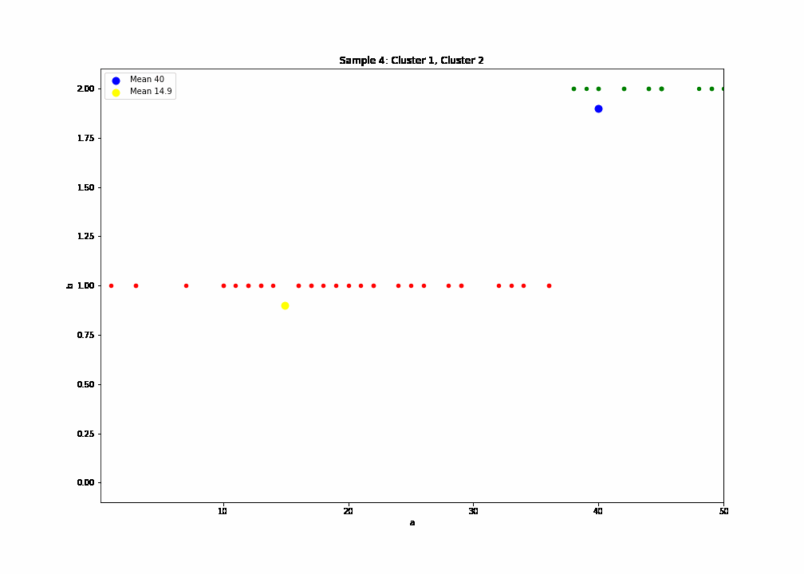

# k-means-clustering
Given one dimension sample and guesses means, prints procedure step by step.

```
python k_means_clustering.py <SAMPLE>.csv <GUESS_MEANS>.csv

It uses Manhattan distance calculation.

USAGE

	SAMPLE is a file name for samples file. One row file with numbers comma separated.

	GUESS_MEANS is a file name for guesses means file.  One row file with guesses means comma separated selected from SAMPLE file.
```

### Example

$ python k_means_clustering.py [sample4.csv](./sample4.csv) [guess_means4.csv](./guess_means4.csv) > [output4.txt](./output4.txt)

***Plotting generated "save < iteration N >.csv" files using Pandas framework:***



### About

Course: Artifical Intelligence

Academic: Sara García

